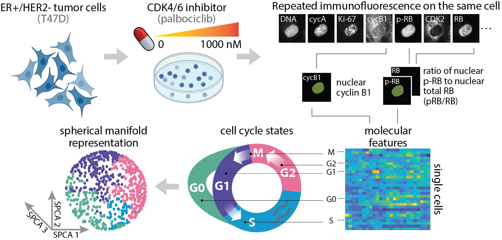

# SPCA on Single-Cell Breast Tumor Data

## Overview 


## Introduction 
Spherical principal component analysis ([SPCA](https://doi.org/10.1111/rssb.12508)) is a manifold approximation method that assumes high-dimensional data lie on a low-dimensional sphere. We performed SPCA on multiplex, single-cell profiles of ER+/HER2- breast tumor cells (T47D) treated with varying doses of palbociclib, a CDK4/6 inhibitor. Here, we show that SPCA is an ideal method for preserving the inherent geometric structure of cell cycle data and characterizing dose response in comparison to other approaches, specifically Potential of Heat-diffusion for Affinity-based Trajectory Embedding ([PHATE](https://doi.org/10.1038/s41587-019-0336-3)) and principal component analysis (PCA). Using SPCA manifolds as a low-dimensional embedding for trajectory inference, Slingshot identified cell cycle trajectories that validated known cyclical trends of protein expression and pointed to potential mechanisms of CDK4/6 inhibitor resistance. 

## Installation and Example Usage 
- Clone the git repository: 
```
git clone https://github.com/PurvisLabTeam/singlecell_spca.git
```

- Run [methods.ipynb](./methods.ipynb) to perform SPCA, PCA, and PHATE. 

- Run the following files to identify Slingshot trajectories using each of the lower-dimensional embeddings: 
    - [ti/spca_traj.Rmd](./ti/spca_traj.Rmd)
    - [ti/pca_traj.Rmd](./ti/pca_traj.Rmd)
    - [ti/phate_traj.Rmd](./ti/phate_traj.Rmd)

- Run [method_comparisons.ipynb](./method_comparisions.ipynb) to compare performance of SPCA, PCA, and PHATE. 

## Dependencies 
Data analysis was performed using Python (v3.11.6) and R (v4.2.3). NumPy (v1.26), pandas (v2.1.3), scikit-learn (v1.3.2), SciPy (v1.11.14), loess (v2.1.2), and phate (v1.0.11) Python libraries were used to perform SPCA, PCA, PHATE, and other statistical analyses. Seurat (v4.3.0), slingshot (v2.6.0), tidyr (v1.3.0), and dplyr (v1.1.2) R packages were used to perform Slingshot. The matplotlib (v3.8.2) Python library was used for data visualization. 

## Description 
- [data/T47D.csv](./data/T47D.csv) - Dataset of 20-feature proteomic profiles and cell cycle phase labels for ER+/HER2- breast tumor cells (T47D) treated with 0 nM, 1 nM, 10 nM, 100 nM, or 1,000 nM palbociclib. These profiles were obtained by performing multiplex, single-cell imaging using a process called iterative indirect immunofluorescence imaging ([4i](https://doi.org/10.21769/BioProtoc.4712)). 
- [utils.py](./utils.py) - SPCA algorithms were implemented using equations described [here](https://doi.org/10.1111/rssb.12508).
- [methods.ipynb](./methods.ipynb) - Reduce high-dimensional dataset using SPCA, PCA, and PHATE. Perform analysis of single-cell data using SPCA. 
- [method_comparisons.ipynb](./method_comparisions.ipynb) - Comparison of manifold learning approaches (SPCA, PCA, PHATE) across treatment conditions using Slingshot trajectories. 
- Perform trajectory inference using [Slingshot](https://doi.org/10.1186/s12864-018-4772-0) for each manifold learning approach and treatment condition. 
    - [ti/spca_traj.Rmd](./ti/spca_traj.Rmd)
    - [ti/pca_traj.Rmd](./ti/pca_traj.Rmd)
    - [ti/phate_traj.Rmd](./ti/phate_traj.Rmd)

## Figures 
All figures are saved as pdfs in the [figures](./figures/) folder. To save and view figures interactively, follow the following steps: 
- Import the pickle package: 
```
import pickle 
```
- Save the figure as a binary file: 
```
pickle.dump(fig, open('[fileName]', 'wb')) 
```
- Read the binary file to open the interactive figure: 
```
fig = pickle.load(open('[fileName]', 'rb'))
fig.show() 
```  
Supplemental figures can be found in [supplement.pdf](./supplement.pdf). 

## License 
This software is licensed under the [MIT license](https://opensource.org/licenses/MIT).